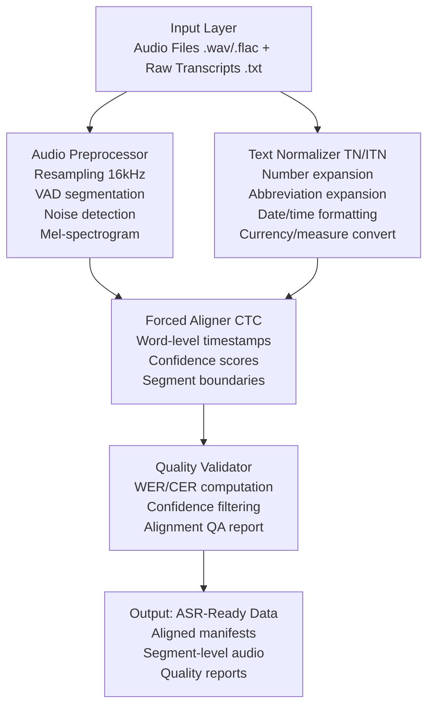

# NeMo Speech Alignment & Text Normalization

> **Production-grade speech data preparation pipeline using NVIDIA NeMo for text normalization (numbers, abbreviations, dates) and audio-text forced alignment, with automated quality validation and an interactive Streamlit demo.**

[](https://www.python.org/downloads/)
[](https://github.com/NVIDIA/NeMo)
[](LICENSE)

---

## Overview

This project builds a complete speech data normalization and alignment toolkit for preparing large-scale ASR (Automatic Speech Recognition) datasets. It combines:

- **Text Normalization (ITN/TN)**: Converts written-form text to spoken-form (e.g., `"$3.50"` → `"three dollars and fifty cents"`, `"Dr."` → `"Doctor"`, `"01/15/2024"` → `"January fifteenth twenty twenty four"`)
- **Audio-Text Forced Alignment**: Aligns transcripts to audio at word/segment level using CTC-based models
- **Quality Validation**: Automated metrics (WER, CER, confidence scores) with configurable thresholds
- **Interactive Demo**: Streamlit UI for exploring normalization, alignment visualization, and batch processing

## Architecture



## Quick Start

### Installation

```bash
# Clone the repository
git clone https://github.com/jayguwalani/nemo-speech-alignment.git
cd nemo-speech-alignment

# Create virtual environment
python -m venv venv
source venv/bin/activate  # Linux/Mac

# Install dependencies
pip install -r requirements.txt
```

### Run the Demo

```bash
# Launch the interactive Streamlit demo
streamlit run demo/app.py

# Or run the CLI pipeline
python -m src.pipeline --audio data/sample_audio/ --text data/sample_transcripts/ --output output/
```

### Run Tests

```bash
pytest tests/ -v --tb=short
```

## Project Structure

```
nemo-speech-alignment/
├── README.md
├── LICENSE
├── requirements.txt
├── setup.py
├── configs/
│   └── pipeline_config.yaml
├── src/
│   ├── __init__.py
│   ├── pipeline.py              # End-to-end orchestrator
│   ├── text_normalizer.py       # TN/ITN engine
│   ├── audio_preprocessor.py    # Audio loading, resampling, VAD
│   ├── forced_aligner.py        # CTC-based forced alignment
│   ├── quality_validator.py     # WER/CER, confidence, QA
│   └── utils.py                 # Shared utilities
├── demo/
│   └── app.py                   # Streamlit interactive demo
├── tests/
│   ├── test_text_normalizer.py
│   ├── test_audio_preprocessor.py
│   ├── test_quality_validator.py
│   └── test_pipeline.py
├── data/
│   └── sample_audio/            # Sample WAV files for demo
└── output/                      # Generated manifests & reports
```

## Features

### Text Normalization
- Cardinal/ordinal number expansion (`42` → `forty two`)
- Currency conversion (`$3.50` → `three dollars and fifty cents`)
- Date formatting (`01/15/2024` → `January fifteenth twenty twenty four`)
- Abbreviation expansion (`Dr.`, `Mr.`, `St.`, `Ave.`, etc.)
- Time conversion (`3:30 PM` → `three thirty P M`)
- Measure/unit expansion (`5kg` → `five kilograms`)

### Audio-Text Forced Alignment
- Word-level and segment-level timestamp generation
- CTC-based alignment using pretrained acoustic models
- Confidence scoring per word/segment
- Automatic silence/pause detection

### Quality Validation
- Word Error Rate (WER) and Character Error Rate (CER)
- Per-segment confidence thresholds
- Automated flagging of low-quality alignments
- Batch QA report generation with statistics

## Technologies

- **NVIDIA NeMo** – ASR models, text processing, forced alignment
- **Conformer-CTC** – Acoustic model architecture
- **Python** – Core implementation
- **Librosa / SoundFile** – Audio I/O and processing
- **Streamlit** – Interactive demo UI
- **PyYAML** – Configuration management

## License

MIT License – see [LICENSE](LICENSE) for details.
